# main topics in git 

 1. git merge  && fast forword merge
 2. Cherry Pick
 3. Rebase Git 
 4. remove commit 

# 1. Git merge
* Merging is Git's way of putting a forked history back together again. The git merge command lets you take the independent lines of development created by git branch and integrate them into a single branch. 
* Note that all of the commands presented below merge into the current branch. 
* The current branch will be updated to reflect the merge, but the target branch will be completely unaffected. 
* Again, this means that git merge is often used in conjunction with git checkout for selecting the current branch and git branch -d for deleting the obsolete target branch.

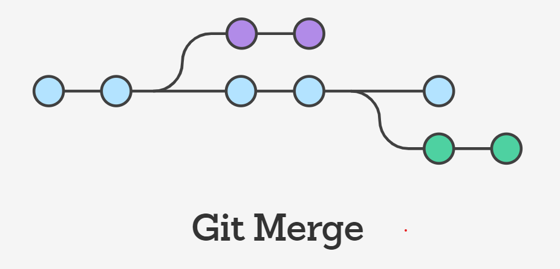

#### How it works 
* Git merge will combine multiple sequences of commits into one unified history. 
* In the most frequent use cases, git merge is used to combine two branches. 
* The following examples in this document will focus on this branch merging pattern. In these scenarios, git merge takes two commit pointers, usually the branch tips, and will find a common base commit between them. 
* Once Git finds a common base commit it will create a new "merge commit" that combines the changes of each queued merge commit sequence.

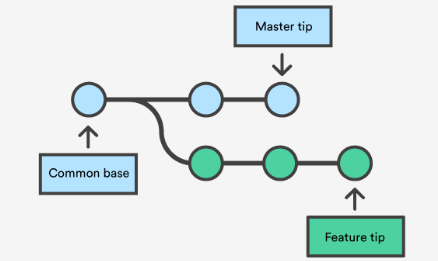

#### Now want to merge this feature branch into master

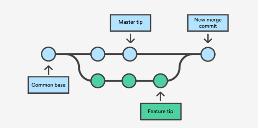


#### Preparing to merge
Before performing a merge there are a couple of preparation steps to take to ensure the merge goes smoothly.

#### Confirm the receiving branch
Execute git status to ensure that HEAD is pointing to the correct merge-receiving branch. If needed, execute git checkout <receiving> to switch to the receiving branch. In our case we will execute git checkout master.

#### Fetch latest remote commits
Make sure the receiving branch and the merging branch are up-to-date with the latest remote changes. Execute git fetch to pull the latest remote commits. Once the fetch is completed ensure the master branch has the latest updates by executing git pull.

#### Merging
Once the previously discussed "preparing to merge" steps have been taken a merge can be initiated by executing git merge <branch name> where <branch name> is the name of the branch that will be merged into the receiving branch.

#### Fast Forward Merge
A fast-forward merge can occur when there is a linear path from the current branch tip to the target branch. Instead of “actually” merging the branches, all Git has to do to integrate the histories is move (i.e., “fast forward”) the current branch tip up to the target branch tip. This effectively combines the histories, since all of the commits reachable from the target branch are now available through the current one. For example, a fast forward merge of some-feature into master would look something like the following:

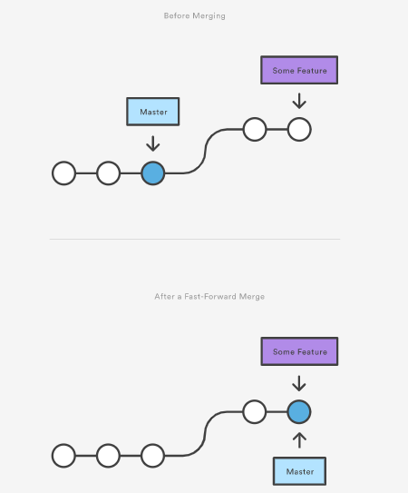

However, a fast-forward merge is not possible if the branches have diverged. When there is not a linear path to the target branch, Git has no choice but to combine them via a 3-way merge. 3-way merges use a dedicated commit to tie together the two histories. The nomenclature comes from the fact that Git uses three commits to generate the merge commit: the two branch tips and their common ancestor.


## example 

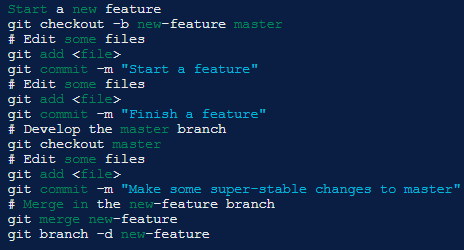

# Resolving conflict
If the two branches you're trying to merge both changed the same part of the same file, Git won't be able to figure out which version to use. When such a situation occurs, it stops right before the merge commit so that you can resolve the conflicts manually.

The great part of Git's merging process is that it uses the familiar edit/stage/commit workflow to resolve merge conflicts. When you encounter a merge conflict, running the git status command shows you which files need to be resolved. For example, if both branches modified the same section of hello.py, you would see something like the following:

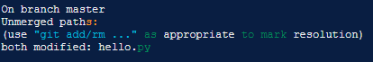

# How conflicts are presented

When Git encounters a conflict during a merge, It will edit the content of the affected files with visual indicators that mark both sides of the conflicted content. These visual markers are: <<<<<<<, =======, and >>>>>>>. Its helpful to search a project for these indicators during a merge to find where conflicts need to be resolved.

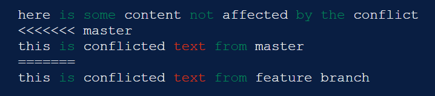

Generally the content before the ======= marker is the receiving branch and the part after is the merging branch.
Once you've identified conflicting sections, you can go in and fix up the merge to your liking. When you're ready to finish the merge, all you have to do is run git add on the conflicted file(s) to tell Git they're resolved. Then, you run a normal git commit to generate the merge commit. It’s the exact same process as committing an ordinary snapshot, which means it’s easy for normal developers to manage their own merges.


# 2. Git Cherry Pick

* git cherry-pick is a powerful command that enables arbitrary Git commits to be picked by reference and appended to the current working HEAD. Cherry picking is the act of picking a commit from a branch and applying it to another.
* git cherry-pick can be useful for undoing changes. For example, say a commit is accidently made to the wrong branch.
* You can switch to the correct branch and cherry-pick the commit to where it should belong.

## When to use git cherry pick
* git cherry-pick is a useful tool but not always a best practice. Cherry picking can cause duplicate commits and many scenarios where cherry picking would work, traditional merges are preferred instead. 
* With that said git cherry-pick is a handy tool for a few scenarios...

## Team collaboration.
* Often times a team will find individual members working in or around the same code. 
* Maybe a new product feature has a backend and frontend component. There may be some shared code between to two product sectors. 
* Maybe the backend developer creates a data structure that the frontend will also need to utilize. 
* The frontend developer could use git cherry-pick to pick the commit in which this hypothetical data structure was created. 
* This pick would enable the frontend developer to continue progress on their side of the project.

## Bug hotfixes
* When a bug is discovered it is important to deliver a fix to end users as quickly as possible. 
#### For an example scenario,say a developer has started work on a new feature. 
* During that new feature development they identify a pre-existing bug. 
* The developer creates an explicit commit patching this bug. 
* This new patch commit can be cherry-picked directly to the master branch to fix the bug before it effects more users.

## Undoing changes and restoring lost commits
* Sometimes a feature branch may go stale and not get merged into master. Sometimes a pull request might get closed without merging. 
* Git never loses those commits and through commands like git log and git reflog they can be found and cherry picked back to life.


# how to use git cheery-pick
* how to use git cherry-pick let us assume we have a repository with the following branch state:

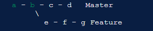

git cherry-pick usage is straight forward and can be executed like:


---
git cherry-pick commitSha

---

* In this example commitSha is a commit reference. 
* You can find a commit reference by using git log.
* In this example we have constructed lets say we wanted to use commit `f` in master. 
* First we ensure that we are working on the master branch.

---

#### executive following commands
* git checkout master
* git cherry-pick f

---
#### Examples
```
1. git cherry-pick master
Apply the change introduced by the commit at the tip of the master branch and create a new commit with this change.

2. git cherry-pick ..master
git cherry-pick ^HEAD master
Apply the changes introduced by all commits that are ancestors of master but not of HEAD to produce new commits.

3. git cherry-pick maint next ^master
git cherry-pick maint master..next
Apply the changes introduced by all commits that are ancestors of maint or next, but not master or any of its ancestors. Note that the latter does not mean maint and everything between master and next; specifically, maint will not be used if it is included in master.

4. git cherry-pick master~4 master~2
Apply the changes introduced by the fifth and third last commits pointed to by master and create 2 new commits with these changes.

5. git cherry-pick -n master~1 next
Apply to the working tree and the index the changes introduced by the second last commit pointed to by master and by the last commit pointed to by next, but do not create any commit with these changes.

6. git cherry-pick --ff ..next
If history is linear and HEAD is an ancestor of next, update the working tree and advance the HEAD pointer to match next. Otherwise, apply the changes introduced by those commits that are in next but not HEAD to the current branch, creating a new commit for each new change.

7. git rev-list --reverse master -- README | git cherry-pick -n --stdin
Apply the changes introduced by all commits on the master branch that touched README to the working tree and index, so the result can be inspected and made into a single new commit if suitable.

```

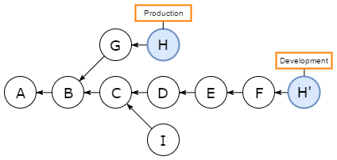


# 3. Rebase
In Git, the rebase command integrates changes from one branch into another. It is an alternative to the better known "merge" command.

Most visibly, rebase differs from merge by rewriting the commit history in order to produce a straight, linear succession of commits.


# Rebase Def:
* Rebasing is the process of moving or combining a sequence of commits to a new base commit. 
* Rebasing is most useful and easily visualized in the context of a feature branching workflow. 
* The general process can be visualized as the following:

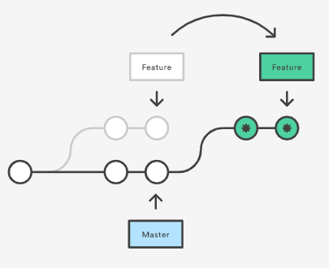


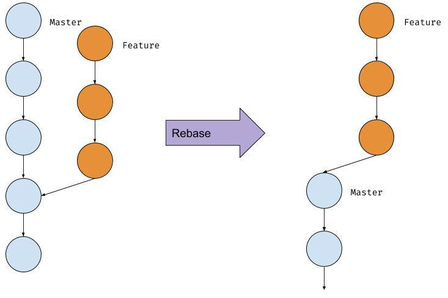

 Rebasing is the process of moving or combining a sequence of commits to a new base commit. Rebasing is most useful and easily visualized in the context of a feature branching workflow.
* Running git rebase with the -i flag begins an interactive rebasing session. Instead of blindly moving all of the commits to the new base, interactive rebasing gives you the opportunity to alter individual commits in the process.
* This lets you clean up history by removing, splitting, and altering an existing series of commits.
* The command line argument --onto can be passed to git rebase. When in git rebase --onto mode the command expands to

```
1. git rebase <base> (checkin into which branch you want to rebase)
2. git rebase -i <base> ( here picking individual commits)
3. git rebase --onto <newbase> <oldbase>
4. git rebase --onto master featureA featureB
```
# changing the last commit(commit messege also changed)

* The git commit --amend command is a convenient way to modify the most recent commit. It lets you combine staged changes with the previous commit instead of creating an entirely new commit.
```
1. git commit --amend
2. git commit --amend -m "an updated commit message"
```

# 4. Remove commit 

To remove the last commit from git, you can simply run git reset --hard HEAD^ If you are removing multiple commits from the top, you can run git reset --hard HEAD~2 to remove the last two commits. 
* You can increase the number to remove


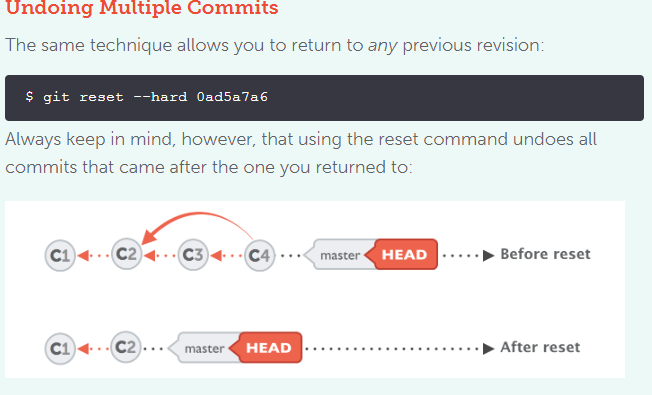


