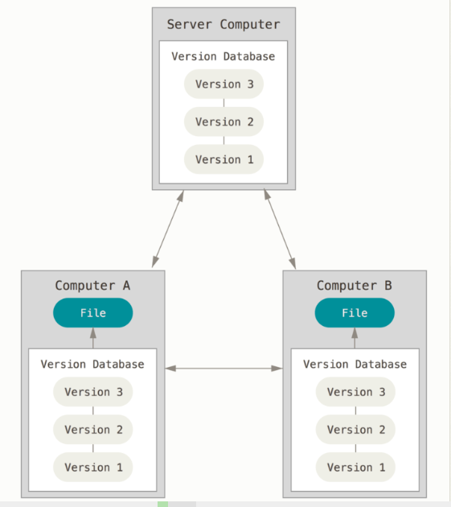
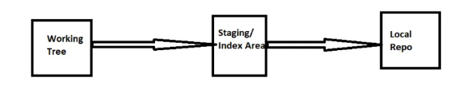
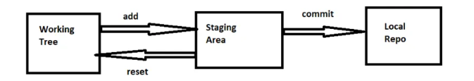
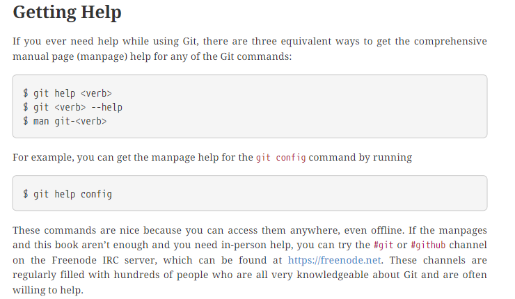
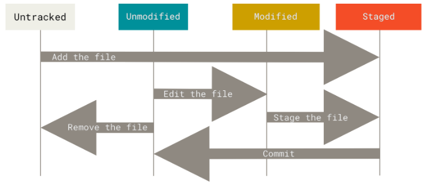
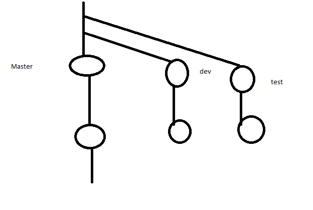
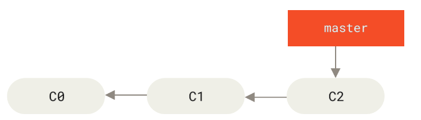
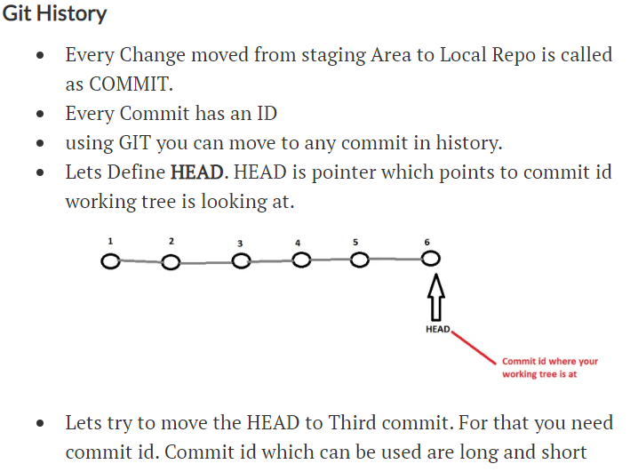

# Git 

* Git is a distributed version-control system for tracking changes in source code during software development. 
* It is designed for coordinating work among programmers, but it can be used to track changes in any set of files. Its goals include speed, data integrity, and support for distributed, non-linear workflows.

# Git Stages

* Working tree/Local tree
* Staging area/Indexing area
* Local Repository
* Remote Repository
* Stash


# Distributed Version Control Systems
* This is where Distributed Version Control Systems (DVCSs) step in. 
* In a DVCS (such as Git, Mercurial, Bazaar or Darcs), clients don’t just check out the latest snapshot of the files; rather, they fully mirror the repository, including its full history. 
* Thus, if any server dies, and these systems were collaborating via that server, any of the client repositories can be copied back up to the server to restore it. 
* Every clone is really a full backup of all the data.



# Git Operations on Node (Local)
* Lets create a git Repository
* Create a folder and cd into it
    * mkdir learninggit
    * cd learninggit

* Mark this folder into repository by executing git init
    * In Git we have 3 logical areas
        * Working Tree
        * Staging Area/Index Area
        * Local Repo / git database



## Local Repo Workflow
* Make changes in Working Tree
* Add the changes to Staging Area
* Save the changes from Staging Area to Local Repo.

* Now lets try to commit the change from staging Area to Local Repo. To do this we can use the command git commit.
* This command requires 3 details
    * Username
    * Email
    * Message

* Username and Email can be configured once at the system level, but message has to passed for every commit.
    * To configure email and username
        * git config --global user.name "<yourusername>"
        * git config --global user.email "<youremailid>"

## Moving Changes from Staging Area to Working Tree
* Reset command can help in doing this Preview



## help



## Recording Changes to the Repository


---

# Git Branching

* Nearly  every  VCS  has  some  form  of  branching  support.  
* Branching  means  you  diverge  from  the main  line  of  development  and  continue  to  do  work  without  messing  with  that  main  line.  
* In  many VCS  tools,  this  is  a  somewhat  expensive  process,  often  requiring  you  to  create  a  new  copy  of  yoursource code directory, which can take a long time for large project



#### Basic Branching
First, let’s say you’re working on your project and have a couple of commits already on the masterbranch.



## Git



# Branching Commands

* The default git branch is Master

```
1. To create new branch
      git branch <branchname> (green mark indicates current branch name)
2. To see the branches list
      git branch
3. To create new branch and switch to that new branch
      git checkout -b <branchname>
4. To switch particular branch
      git checkout <branchname>
5. Merging child branch changes to Parent branch
      git merge <branchname> (move the destination branch)
6. To view the diffrence b/w branch or commitids
      git diff <commitid> <commitid>
      git diff <branch> <branch>
```

## steps to create branche and go to that branch
```
* git branch sprint-1
* git branch 
* git checkout sprint-1
  
```

## main topics in git 

 1. git merge  && fast forword merge
 2. rebase
 3. cherry-pick
 4. remove commit 

 [clickhere](./main.md)